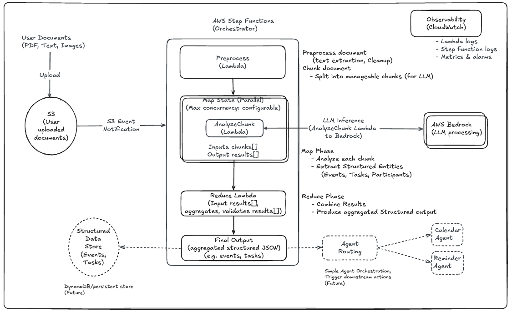

# Agent-Ready LLM Document Intelligence Pipeline (Map-Reduce)

## Overview

Large Language Models are powerful — but real-world systems require more than a single prompt.

This project demonstrates how to build a scalable LLM pipeline using a Map-Reduce architecture to extract structured insights (tasks, events, participants, deadlines) from large unstructured documents.

Instead of sending the entire document to an LLM, the system uses a **Map-Reduce architecture** to process large inputs efficiently and reliably.

---

## Why This Matters

Most LLM demos focus on single prompts.

Real-world applications require:
- Handling inputs beyond LLM context limits  
- Parallel processing for scale  
- Consistent and structured outputs  

This project demonstrates how to move from prompt-based experiments to production-style AI systems.

---

## Problem

Unstructured text is everywhere:

* Email threads
* Meeting notes
* Team communications

Extracting actionable insights manually is slow and error-prone.

---

## Solution

This system:

1. Reads documents from S3
2. Splits them into chunks (to handle large inputs)
3. Processes each chunk in parallel using an LLM
4. Aggregates structured outputs into a single result

---

## Key Design Decision

Instead of relying solely on prompt instructions, this system enforces business logic at the pipeline level.

For example:
- Past events are filtered in the reduce stage
- Output consistency is maintained across chunks

This separation ensures deterministic and reliable behavior.

---

## Architecture

```
S3 (input document)
  ↓
Preprocess Lambda (chunking)
  ↓
Step Functions Map (parallel LLM processing)
  ↓
Analyze Lambda (LLM extraction)
  ↓
Reduce Lambda (aggregation)
  ↓
Final
```


## Architecture Diagram



*Scalable LLM pipeline using a Map-Reduce pattern with agent-ready extensions*

---

## Key Features

* **Chunking** to overcome LLM context limits
* **Parallel processing** using Step Functions Map state
* **Structured extraction**:

  * Tasks
  * Events
  * Participants
  * Deadlines
* **Deterministic time resolution** (e.g., “tomorrow” → actual date)
* **Filters non-actionable past events**
* **Clean JSON output** for downstream automation
* **Agent-ready architecture** (can integrate with calendar, reminders, workflows)

---

## Example

### Input

Hi John,
Let’s meet next Friday at 3 PM to discuss Q2 roadmap.

Also remind me to send the budget report tomorrow.

Aaron asked us to send the Jira# for the PERF issue.

Entire dev team should be available for retro review tomorrow at 10am.

---

### Output

```json
{
  "events": [
    {
      "title": "Meet to discuss Q2 roadmap",
      "date": "2026-05-05",
      "time": "15:00",
      "participants": ["me", "John"]
    },
    {
      "title": "Retro review of the release R25",
      "date": "2026-04-30",
      "time": "10:00",
      "participants": ["dev team"]
    }
  ],
  "tasks": [
    {
      "task": "send the budget report",
      "owner": "me",
      "due": "2026-04-30"
    },
    {
      "task": "send the Jira# for the PERF issue",
      "owner": "me",
      "due": ""
    }
  ]
}
```

---

## Tech Stack

* AWS Step Functions
* AWS Lambda
* Amazon S3
* Amazon Bedrock (LLM: Nova Pro)
* Python

---

## Design Highlights

* Applies **Map-Reduce pattern to LLM workflows**
* Separates concerns: ingestion, processing, aggregation
* Handles **temporal ambiguity** via prompt context injection
* Supports **multi-chunk parallel reasoning**
* Produces **structured outputs for automation systems**

---

## Limitations

* Coreference resolution (e.g., “it”, “him”) may be imperfect
* Owner inference depends on conversational context
* Chunk-based processing may lose cross-sentence references

---

## Future Improvements

* Add vector database (RAG) for context enrichment
* Cross-chunk entity resolution
* Deduplication and prioritization of tasks
* Integration with calendar / reminder agents
* UI layer for interaction

---

## How to Run (Conceptual)

1. Upload input file to S3
2. Trigger Step Function with:

```json
{
  "bucket": "<your-bucket>",
  "key": "<your-file>"
}
```

3. Replace placeholders in state machine with actual Lambda ARNs

---

## Author

Anbarasu Samiappan
Engineering Leader | Distributed Systems | AI Systems
